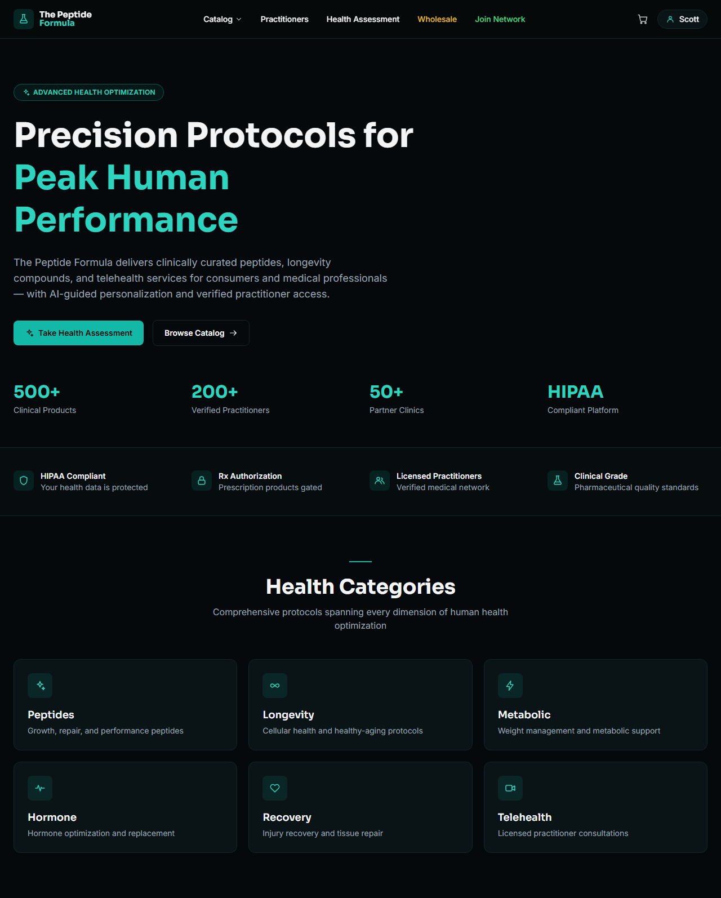
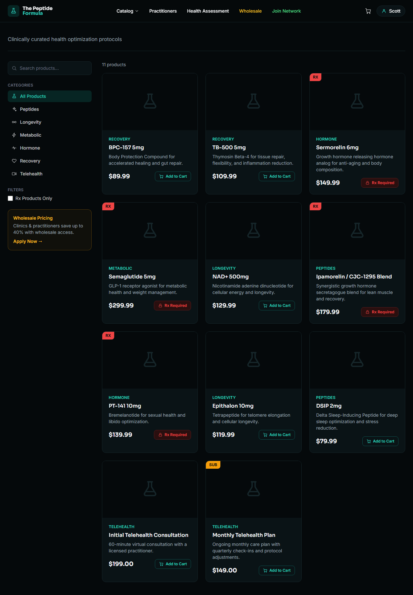
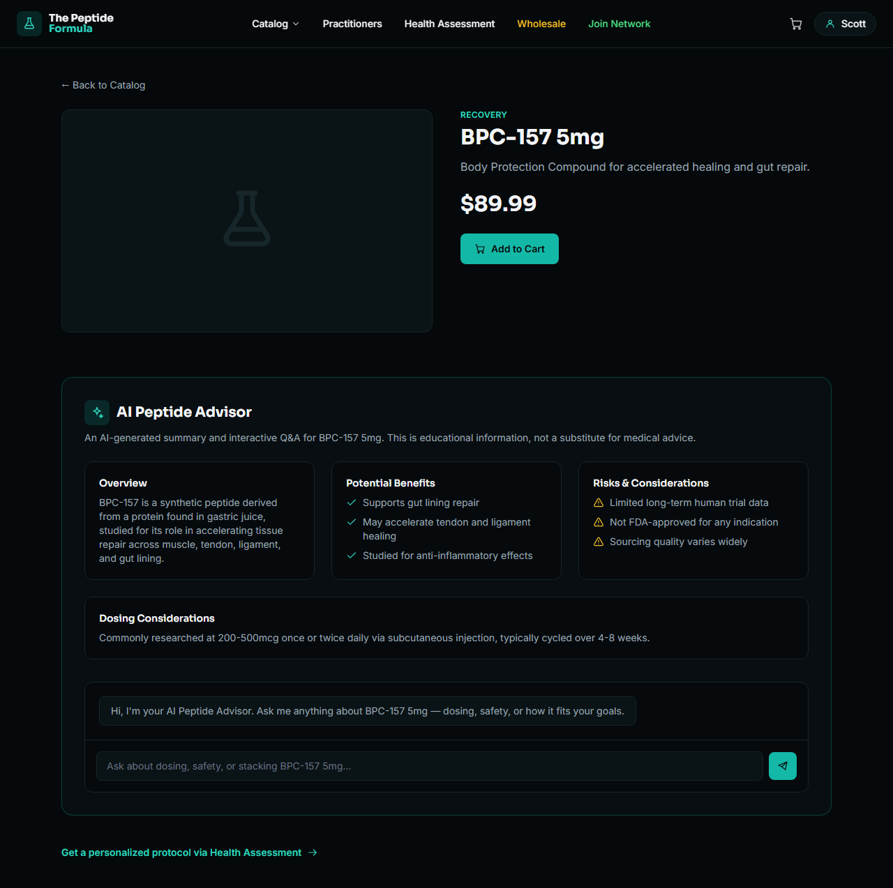

# Peptide Advisor

A frontend rebuild of [The Peptide Formula](https://peptidehub-2ejbvynz.manus.space/) — a peptide/longevity
e-commerce and telehealth site — extended with a custom **AI Peptide Advisor** on every product page: an
auto-generated overview/benefits/risks/dosing summary plus a live D-ID video avatar you can chat with for
follow-up questions.

## Screenshots

**Home**



**Catalog**



**Product detail with AI Peptide Advisor**



## Project structure

```
peptide-advisor/
├── client/                 React + TypeScript + Vite frontend
│   ├── src/
│   │   ├── components/     Header, Layout, and shared icon set
│   │   ├── data/           Mock product/category data (products.ts)
│   │   ├── pages/          Home, Catalog, ProductDetail, ComingSoon
│   │   ├── App.tsx         Route definitions
│   │   ├── main.tsx        App entry point (BrowserRouter)
│   │   └── index.css       Tailwind v4 theme tokens (colors, fonts)
│   └── vite.config.ts
├── server/                 Node/Express API
│   └── src/
│       ├── index.js        App entry point (Express, CORS, dotenv)
│       ├── routes/         advisor.js — D-ID stream proxy endpoints
│       ├── providers/      did.js — D-ID Streams API client
│       └── data/           Server-side data access
└── docs/screenshots/       README screenshots
```

The client currently runs entirely on mock data in `client/src/data/products.ts`. The `server/` directory
implements a thin proxy in front of the [D-ID](https://www.d-id.com/) Streams API: it keeps the D-ID API key
server-side and relays WebRTC signaling (offer/answer/ICE) and "speak" requests on behalf of the client.

## Pages

| Route | Description |
|---|---|
| `/` | Hero, trust indicators, and health category navigation |
| `/catalog` | Searchable/filterable product grid (category, Rx-only) |
| `/product/:id` | Product details + AI Peptide Advisor (summary + live avatar chat) |
| `/practitioners`, `/health-assessment`, `/wholesale`, `/join-network` | Placeholder pages, not yet built |

## Running locally

Start the API server (proxies the D-ID avatar stream):

```bash
cd server
npm install
cp .env.example .env   # then fill in DID_API_KEY
npm run dev
```

In a second terminal, start the client:

```bash
cd client
npm install
npm run dev
```

Then open http://localhost:5173. The Vite dev server proxies `/api/*` requests to the server on
http://localhost:8787.

## Tech stack

- React 19 + TypeScript
- Vite 8
- Tailwind CSS v4 (`@tailwindcss/vite`)
- React Router 7
- Node + Express (API server)
- [D-ID Streams API](https://docs.d-id.com/) (real-time video avatar) via WebRTC
